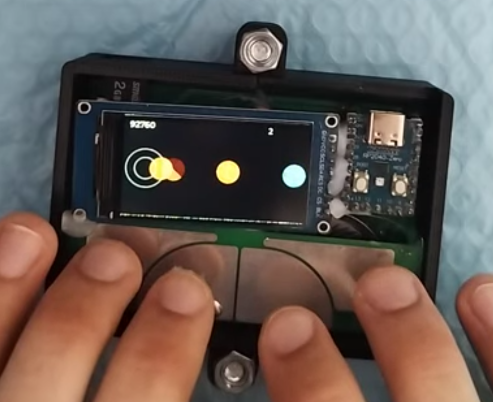
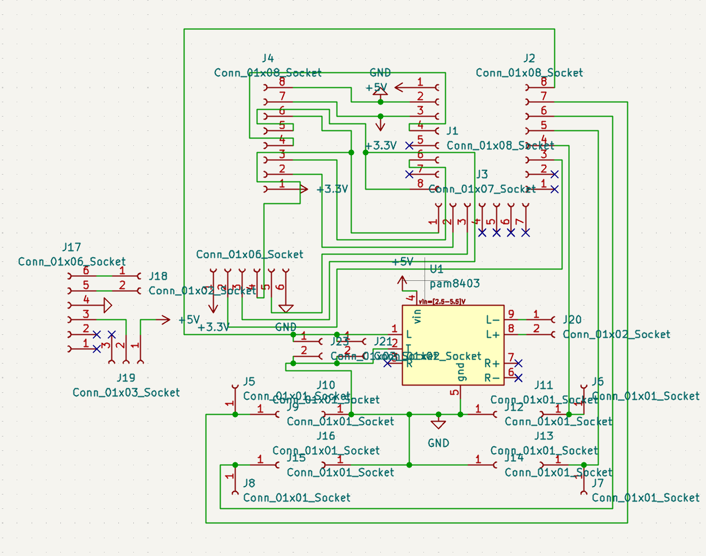
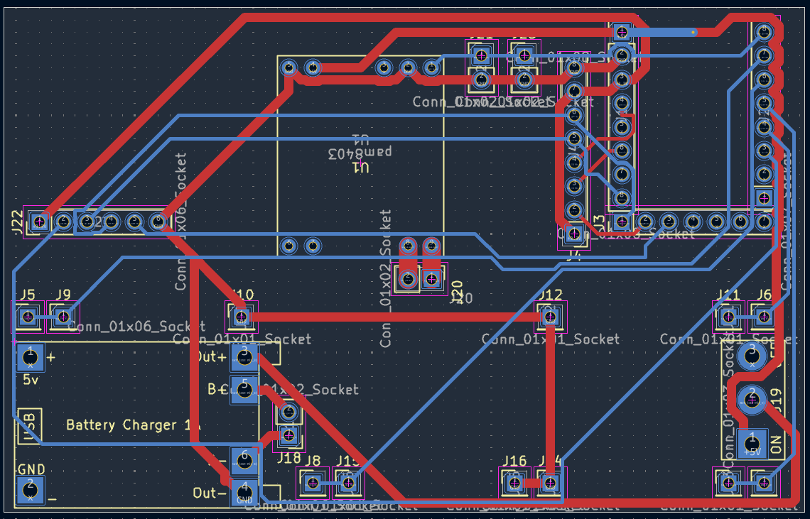
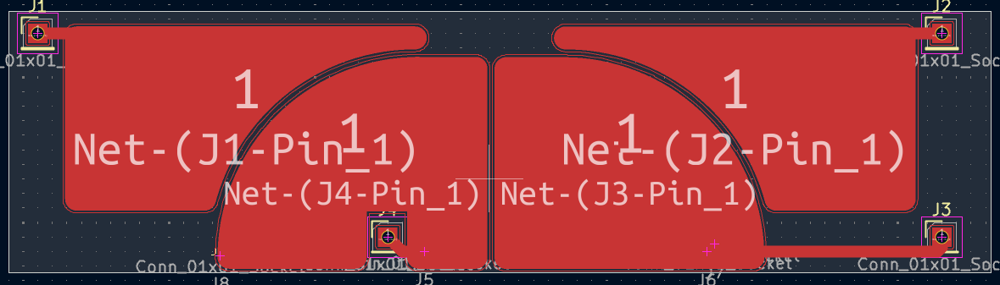
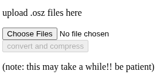

# card::taiko
osu!taiko simulator in a card form-factor!

## what this is
this is an RP2040-Zero based device that is made for simulating osu!taiko as closely as i was able to make it. it comes with capacitive touch buttons specifically shaped for taiko, a 320x170 display, an SD card reader, a speaker and a battery. you can also emulate a keyboard to play taiko-based games on your PC.

## how do i use it?
you'll have to build one yourself!! you can see `bom.xml` for the list of parts, and all the PCBs and modelsn as well as the firmware can also be found in this repository. then, you can convert and upload songs to an sd card using the [online tool](https://milk-cool.github.io/cardtaiko/). you have to put the songs in `/taiko` on the SD card. then, boot up the device, select your song and have fun!! (you can pause at any time by pressing BOOTSEL on the board.)

### building it
there are a few unmarked headers on the pcb. the one closest to the RP2040-Zero is where the display goes, the one in the upper left corner is for the SD card reader, and the four small ones all around the bottom part are where the 1x1 headers go in for the capacitive touch board. speaking of which, you also have to solder in 4 1MOhm resistors near the pins so that capactive touch works.

> important: see the touch board to make sure everything lines up!!

### using the website
the interface is very simple: upload your .osz files, wait for the button to become active (that means that [ffmpeg](https://ffmpeg.org/) has loaded) and click convert!! evrything happens in your browser so it shouldn't take too long to finish.

## why this was made
i am a huge fan of both taiko no tatsujin and osu!taiko, and also the [cardputer](https://shop.m5stack.com/products/m5stack-cardputer-adv-version-esp32-s3), which is why i decided it might be a fun idea to make a device that would let you play taiko on the go. and i also thought people might find the idea interesting as well :D